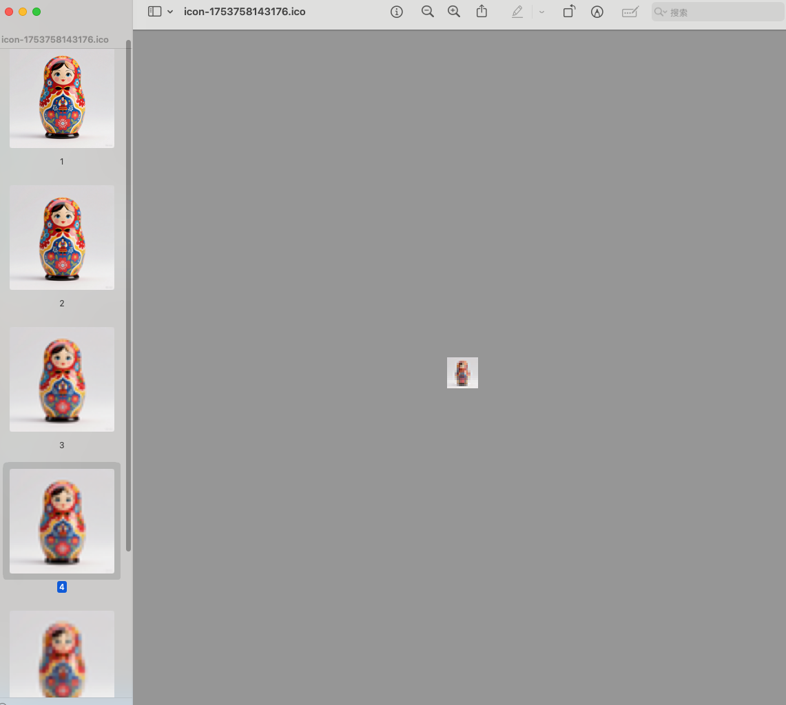
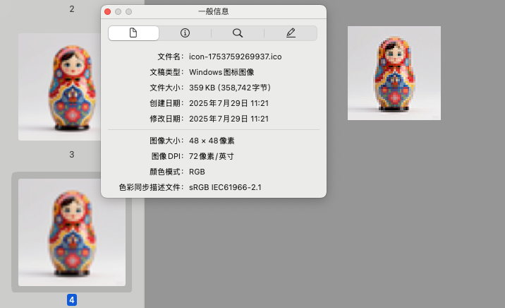

## 做 electron 应用时，生成各平台桌面图标总是需要下软件，不是很方便，想要一个网页版的，所以研究了下，自己做了一版，顺便聊一聊他的实现原理

## 什么是 ico 文件？

- 他就像是 俄罗斯套娃一样，一张图片里，有同一张图片的不同尺寸，如果使用 mac 的图片查看器能看出来

## 相关链接

[msdn Icons](https://learn.microsoft.com/en-us/previous-versions/ms997538(v=msdn.10)?redirectedfrom=MSDN)
