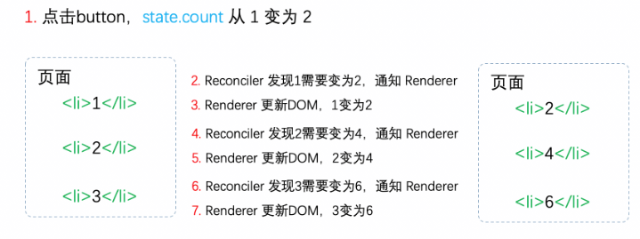
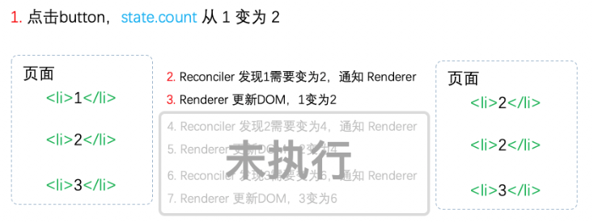
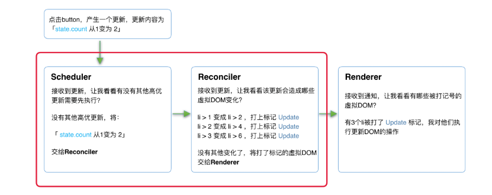

## 原因

react 一直处于会用的阶段，但是由于不懂他的内部原理，个人对他的 hooks 吐槽颇多，比如各种 useMemo, useCallback, useEffect 等各种需要手动优化的方式。hooks 不能在条件中写等限制。个人其实是不太能接受的，所以想深入学习下，并分析下他的设计架构，主要参考网上的资料和官方文档

## React

## 老架构（v15） 与新架构 （v16+）

### 老架构的状况

#### 未中断



- Reconciler和Renderer是交替工作的，当第一个li在页面上已经变化后，第二个li再进入Reconciler。
- 由于整个过程都是同步的，所以在用户看来所有 DOM 是同时更新的。

#### 被中断



- 当第一个li完成更新时中断更新，即步骤 3 完成后中断更新，此时后面的步骤都还未执行。
- 用户本来期望123变为246。实际却看见更新不完全的 DOM！（即223）
- 基于这个原因，React决定重写整个架构。

### 架构对比

- 老架构：基于同步渲染，单线程阻塞式渲染，更新时会阻塞主线程，用户交互会有卡顿
  - Reconciler(协调器): 负责比较新旧虚拟 DOM 树的差异，生成更新补丁
    - 递归处理虚拟 DOM
  - Renderer(渲染器): 负责将更新补丁应用到真实 DOM 上，完成 UI 更新

- 新架构：基于异步渲染，采用了协作式调度，能够将渲染任务拆分成多个小任务，避免阻塞主线程，提高用户交互的流畅度
  - Scheduler（调度器）: 负责调度任务的执行顺序和优先级，高优先级任务（如用户交互）会优先进入 Reconciler，低优先级任务（如数据加载）会在空闲时间执行
  - Reconciler（协调器）： 负责比较新旧虚拟 DOM 树的差异，生成更新补丁
  - Renderer（渲染器）： 负责将更新补丁应用到真实 DOM 上，完成 UI 更新

### 两版 Reconciler 对比

- 老架构 Reconciler（stack reconciler）： 数据保存在递归调用栈中，递归处理虚拟 DOM，无法中断，导致主线程阻塞，
- 新架构 Reconciler（fiber reconciler）： 可中断的循环过程，基于 Fiber
  - 静态数据： 每个 Fiber 节点对应一个 React element, 存了该组件的类型（函数组件/类组件/原生组件...）、对应的DOM节点等信息。
  - 动态数据： 每个Fiber节点保存了本次更新中该组件改变的状态、要执行的工作（需要被删除/被插入页面中/被更新...）。

## React V16 架构深入分析

### 更新流程



- 其中红框中的步骤随时可能由于以下原因被中断：
  - 有其他更高优任务需要先更新
  - 当前帧没有剩余时间
  - 由于红框中的工作都在内存中进行，不会更新页面上的 DOM，所以即使反复中断，用户也不会看见更新不完全的 DOM。

### Scheduler（调度器）

- 以浏览器是否有空闲时间为依据，决定何时执行渲染任务
  - requestIdleCallback API： 浏览器提供的 API，但由于稳定性与兼容问题，React 16 并未直接使用，而是实现了自己的调度机制就是 `Scheduler`

### Reconciler（协调器）

- 可中断的循环过程
- 基于 Fiber 架构，采用增量渲染和优先级调度
  - 增量渲染： 将渲染任务拆分成多个小任务，逐步完成渲染，避免阻塞主线程
  - 优先级调度： 根据任务的优先级，决定任务的执行顺序，高优先级

### 代数效应

- 代数效应是函数式编程中的一个概念，用于将副作用从函数调用中分离。
  - async/await 是代数效应的一种实现方式，但是它具有传染性，凡是调用了 async 函数的函数也必须是 async 函数
  - React Hooks 借鉴了代数效应的 “效应分离” 思想，让函数组件能安全使用状态和副作用，而不需要强制将组件本身变成异步函数

## React Fiber

- 是 react 16 对虚拟 DOM 的称呼，因为是重新实现了
- fiber 的数据结构分析

```js
function FiberNode(
  tag: WorkTag,
  pendingProps: mixed,
  key: null | string,
  mode: TypeOfMode,
) {
  // 作为静态数据结构的属性
  this.tag = tag;
  this.key = key;
  this.elementType = null;
  this.type = null;
  this.stateNode = null;

  // 用于连接其他Fiber节点形成Fiber树
  this.return = null;
  this.child = null;
  this.sibling = null;
  this.index = 0;

  this.ref = null;

  // 作为动态的工作单元的属性
  this.pendingProps = pendingProps;
  this.memoizedProps = null;
  this.updateQueue = null;
  this.memoizedState = null;
  this.dependencies = null;

  this.mode = mode;

  this.effectTag = NoEffect;
  this.nextEffect = null;

  this.firstEffect = null;
  this.lastEffect = null;

  // 调度优先级相关
  this.lanes = NoLanes;
  this.childLanes = NoLanes;

  // 指向该fiber在另一次更新时对应的fiber
  this.alternate = null;
}


{
  type: 'div', // 节点类型
  key: null, // 节点的唯一标识
  stateNode: divElement, // 对应的真实 DOM 节点
  child: null, // 第一个子节点的引用
  sibling: null, // 下一个兄弟节点的引用
  return: null, // 父节点的引用
  effectTag: 'UPDATE', // 标记该节点需要执行的操作（插入、更新、删除等）
  alternate: null, // 指向上一次渲染时对应的 Fiber 节点
  // 其他属性...
}
```

## 参考文档

[React技术揭秘](https://react.iamkasong.com/)
[React Versions](https://reactjs.org/versions)
[React Official Doc](https://react.dev/)

(<https://codesandbox.io/s/fervent-sutherland-pf7sg?file=/src/App.js>)
(<https://codesandbox.io/s/concurrent-3h48s?file=/src/index.js>)
[Suspense](https://codesandbox.io/p/sandbox/objective-joana-fypsf4?file=%2Fsrc%2FfakeApi.js%3A14%2C10-14%2C21)
